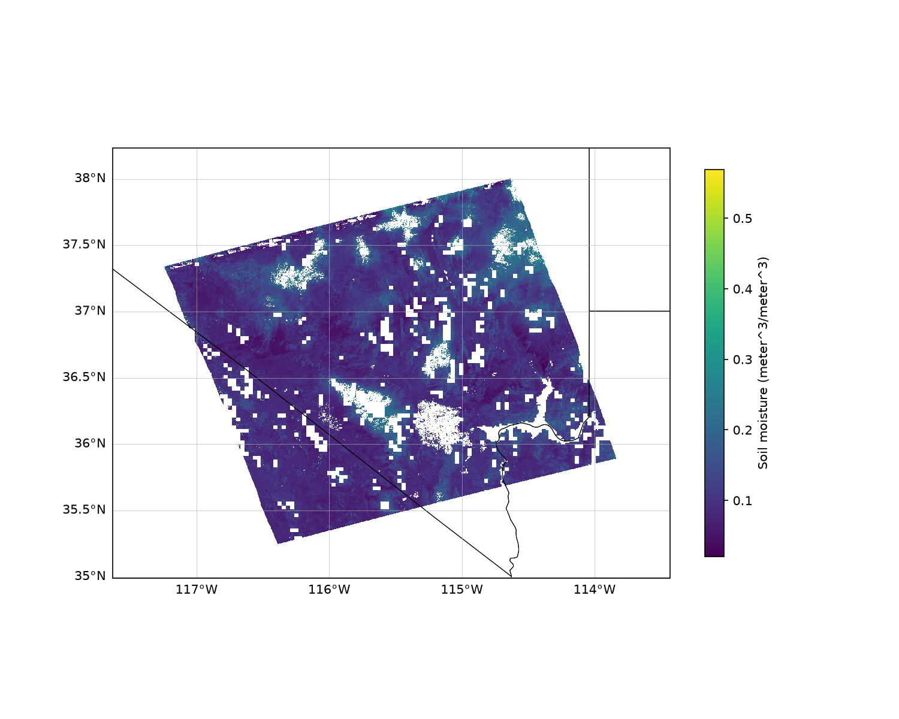

# Exploration of NISAR Data

## NISAR Mission

NISAR (NASA-ISRO SAR) is a joint NASA/ISRO Synthetic Aperture Radar mission
providing global, repeat-pass radar coverage. It carries two SAR
instruments: **L-SAR** (24 cm wavelength, NASA's primary science
instrument, global coverage) and **S-SAR** (9.3 cm wavelength, ISRO,
primarily over India). Both use the SweepSAR scan-on-receive technique to
achieve full-resolution, multi-polarimetric imaging across a >240 km swath.
NISAR is left-looking, giving full coverage of Antarctica but a small gap
near the North Pole. Data is distributed by the Alaska Satellite Facility
(ASF) DAAC; see the
[NISAR Data User Guide](https://nisar-docs.asf.alaska.edu/) for full
documentation.

## NISAR Data

NISAR products range from raw instrument data to analysis-ready geophysical
products, organized into four processing levels:

- **Level 0** - Unfocused raw data (RRSD).
- **Level 1** - Focused, range-Doppler (radar-coordinate) products: RSLC,
  RIFG, ROFF, RUNW.
- **Level 2** - Geocoded, map-projected products: GSLC, GCOV, GOFF, GUNW.
- **Level 3** - Derived geophysical parameters projected to EASE-Grid 2.0:
  Soil Moisture (SME2).

All standard products are distributed as HDF5 files that are internally
structured to be CF/netCDF-compliant. Data maturity is currently either
**BETA** (Jan/Feb 2026 releases, not fully calibrated) or **PROVISIONAL**
(July 2026 onward, fully calibrated, still being validated).

See `.windsurf/skills/nisar-instruments-data/SKILL.md` for detailed notes
on instrumentation, product types, file naming, and HDF5 structure.

### Soil Moisture Data

The [SME2](https://nisar-docs.asf.alaska.edu/sme2) product provides global
soil moisture estimates at 200 m pixel spacing (500 m over the Sahara),
derived from a time-series analysis of Level 2 GCOV backscatter products
using three retrieval algorithms. Nominal revisit is about twice every 12
days, with an accuracy goal of 0.06 m3/m3 over low-vegetation,
unflagged areas. Retrievals are withheld or flagged over dense vegetation,
active precipitation, urban areas, permanent snow/ice, permanent water, and
frozen/snow-covered ground.

This project explores the sample SME2 file in `data/`:
`NISAR_L3_PR_SME2_028_005_A_020_4005_DHDH_A_20260813T125218_20260813T125253_P05023_N_F_J_001.h5`

## Setup

Requires Python >= 3.12. Create a virtual environment and install the
project (dependencies are declared in `pyproject.toml`):

```bash
python3 -m venv .venv
.venv/bin/pip install -e ".[dev]"
```

This installs xarray, netCDF4, matplotlib, and cartopy, plus pytest for
development.

## Plotting Soil Moisture

The `plot-sme2` command (installed with the project) reads an SME2 file and
writes two PNGs to `output/` (untracked): a soil moisture map and a
footprint overview map showing the granule's lat/lon bounds.

```bash
.venv/bin/plot-sme2                    # uses the sample file in data/
.venv/bin/plot-sme2 path/to/file.h5    # or any SME2 .h5 file
.venv/bin/plot-sme2 --show             # also display interactively
.venv/bin/plot-sme2 --output-dir figs  # custom output directory
```

`python -m nisar_play` is equivalent. Note: cartopy downloads Natural Earth
coastline/border shapefiles (map backgrounds, not NISAR data) on first use
and caches them locally.

### Example Output



*Soil moisture (m³/m³) from the sample SME2 granule over southern
Nevada/California, drawn on a cartopy map with state borders and
gridlines. Only recommended retrievals are shown: fill values and pixels
whose `retrievalQualityFlag` marks the retrieval "not recommended" (e.g.
urban areas, water, dense vegetation) are left blank. The tilted swath
edge reflects the satellite's orbit track on the EASE-Grid 2.0 grid.*


*Footprint overview: the granule's lat/lon bounding box (red, ~35–38°N,
117.6–113.4°W) plotted on a padded regional map with coastlines and state
borders, showing where the data sits in the southwestern United States.*

## Documentation

Project documentation (including the API reference) is published at
<https://captainkirk99.github.io/nisar_play/>, built with MkDocs
(Material theme) and mkdocstrings from NumPy-style docstrings, and
deployed to GitHub Pages by a GitHub Actions workflow on pushes to
`main`. To build and preview locally:

```bash
.venv/bin/pip install -e ".[docs]"
.venv/bin/mkdocs serve     # live preview at http://127.0.0.1:8000
.venv/bin/mkdocs build --strict   # build into site/ (untracked)
```

## Running Tests

From the project root:

```bash
.venv/bin/pytest
```

The test suite includes a smoke test that opens the sample SME2 file in
`data/` and verifies its NISAR HDF5 group structure and soil moisture data,
plus tests of the reader functions, plotting (PNG output via the Agg
backend), and the `plot-sme2` CLI. When the (untracked, 119 MB) sample
file is absent — e.g. in CI — the tests run against a small synthetic
SME2-like file generated by `tests/conftest.py`; set
`NISAR_PLAY_FORCE_SYNTHETIC=1` to force this locally.

## Continuous Integration

A GitHub Actions workflow (`.github/workflows/ci.yml`) runs `pytest` and
`mkdocs build --strict` on every pull request targeting `main` and on
pushes to `main`. Branches must pass CI before merging: enable a branch
protection rule on `main` (Settings → Branches) requiring the `test`
status check.